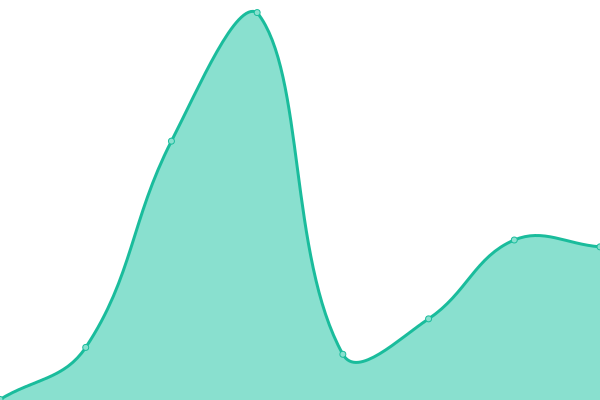

# [📈 Live Status](https://pablokbs.github.io): <!--live status--> **🟩 All systems operational**

This repository contains the open-source uptime monitor and status page for [Upptime](https://upptime.js.org), powered by [Upptime](https://github.com/upptime/upptime).

With [Upptime](https://upptime.js.org), you can get your own unlimited and free uptime monitor and status page, powered entirely by a GitHub repository. We use [Issues](https://github.com/upptime/upptime/issues) as incident reports, [Actions](https://github.com/pablokbs/upptime/actions) as uptime monitors, and [Pages](https://pablokbs.github.io) for the status page.

<!--start: status pages-->
<!-- This summary is generated by Upptime (https://github.com/upptime/upptime) -->
<!-- Do not edit this manually, your changes will be overwritten -->
<!-- prettier-ignore -->
| URL | Status | History | Response Time | Uptime |
| --- | ------ | ------- | ------------- | ------ |
|  [Pichincha Portal Inicio](https://inicio.pichincha.com/portal/inicio) | 🟩 Up | [pichincha-portal-inicio.yml](https://github.com/guillermodep/upptime/commits/HEAD/history/pichincha-portal-inicio.yml) | 

 544ms
     
 | 

<a href="https://guillermodep.github.io/upptime/history/pichincha-portal-inicio">100.00%</a>
    

|  [Pichincha Cuenta Simple](https://cuentasimple.pichincha.com/electronico?utm_source=portal&utm_medium=referral&utm_campaign=cuentasimple&utm_content=btn_home_abrir_cuenta) | 🟩 Up | [pichincha-cuenta-simple.yml](https://github.com/guillermodep/upptime/commits/HEAD/history/pichincha-cuenta-simple.yml) | 

 208ms
     
 | 

<a href="https://guillermodep.github.io/upptime/history/pichincha-cuenta-simple">100.00%</a>
    

|  [Pichincha Banca Web](https://bancaweb.pichincha.com/) | 🟩 Up | [pichincha-banca-web.yml](https://github.com/guillermodep/upptime/commits/HEAD/history/pichincha-banca-web.yml) | 

 612ms
     
 | 

<a href="https://guillermodep.github.io/upptime/history/pichincha-banca-web">100.00%</a>
    

|  [Pichincha Cash Management](https://www.pichincha.com/loginNR/#/loginNR/auth/login) | 🟩 Up | [pichincha-cash-management.yml](https://github.com/guillermodep/upptime/commits/HEAD/history/pichincha-cash-management.yml) | 

 532ms
     
 | 

<a href="https://guillermodep.github.io/upptime/history/pichincha-cash-management">100.00%</a>
    

|  [Pichincha Tarjetas](https://inicio.pichincha.com/portal/servicios-web-tarjetas) | 🟩 Up | [pichincha-tarjetas.yml](https://github.com/guillermodep/upptime/commits/HEAD/history/pichincha-tarjetas.yml) | 

 124ms
     
 | 

<a href="https://guillermodep.github.io/upptime/history/pichincha-tarjetas">100.00%</a>
    

|  [Pichincha Credito Preciso](https://creditoenlinea.pichincha.com/autogestion/login/?utm_source=portal&utm_medium=referral&utm_campaign=preciso&utm_content=btn_acceso_preciso) | 🟩 Up | [pichincha-credito-preciso.yml](https://github.com/guillermodep/upptime/commits/HEAD/history/pichincha-credito-preciso.yml) | 

 234ms
     
 | 

<a href="https://guillermodep.github.io/upptime/history/pichincha-credito-preciso">100.00%</a>
    

|  [Pichincha 4U Portal](https://4u.pichincha.com/auth/ingreso) | 🟩 Up | [pichincha-4-u-portal.yml](https://github.com/guillermodep/upptime/commits/HEAD/history/pichincha-4-u-portal.yml) | 

 290ms
     
 | 

<a href="https://guillermodep.github.io/upptime/history/pichincha-4-u-portal">100.00%</a>
    

<!--end: status pages-->

[**Visit our status website →**](https://pablokbs.github.io)

## 📄 License

- Powered by: [Upptime](https://github.com/upptime/upptime)
- Code: [MIT](./LICENSE) © [Upptime](https://upptime.js.org)
- Data in the `./history` directory: [Open Database License](https://opendatacommons.org/licenses/odbl/1-0/)
